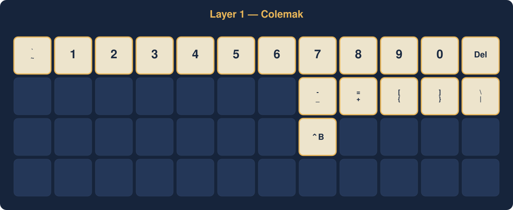
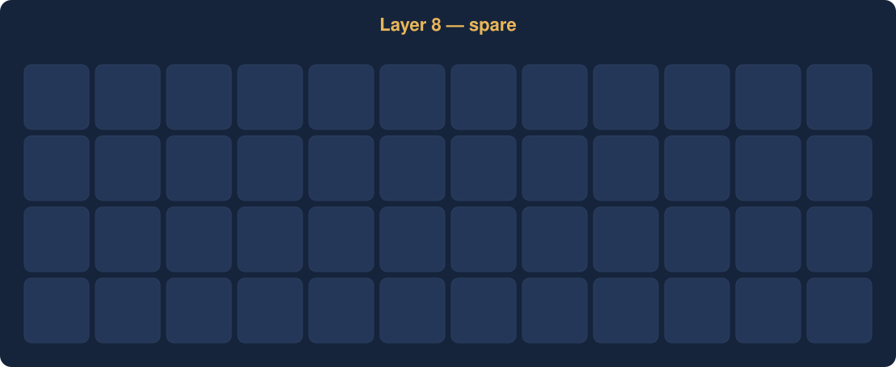
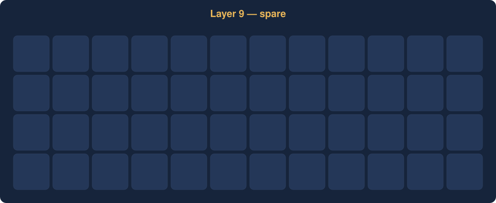
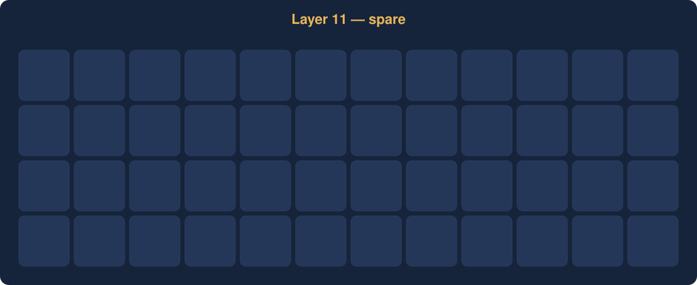
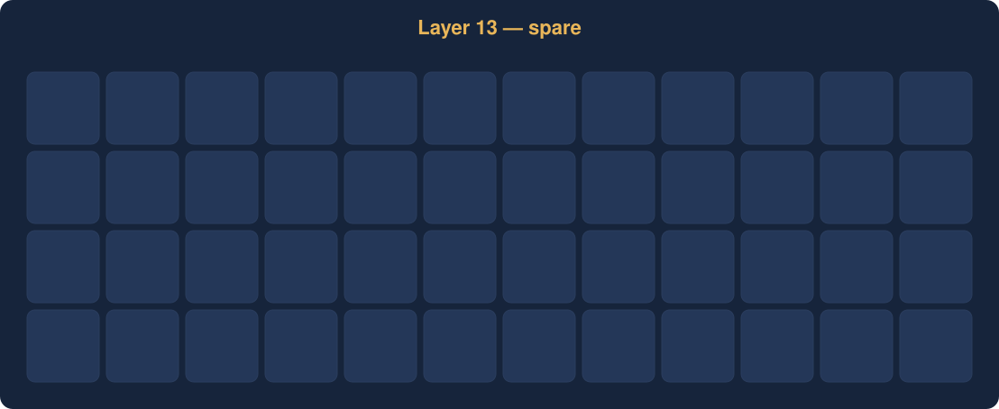
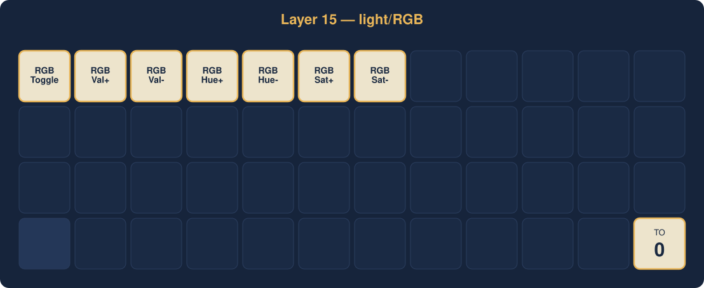

# planck/rev6_drop — `timching_planck_rev6_drop`

_Generated by `tools/render_keymap.py` — do not edit by hand._

| Tier | Look |
|---|---|
| **Mapped key** | Cream fill, dark navy text, orange border |
| **`KC_TRNS`** | Faint silhouette, no label — passes through to layer below |
| **`KC_NO`** | Barely-visible silhouette — key blocked on this layer |

## Layer 0 — QWERTY

## Layer 1 — Colemak

## Layer 2 — numbers+right-symbols (MO2)

## Layer 3 — symbols (MO3)

## Layer 4 — fn (MO4)

## Layer 5 — spare

## Layer 6 — transfer/empty (MO6)

## Layer 7 — transfer-to-light (MO7)

## Layer 8 — spare

## Layer 9 — spare

## Layer 10 — spare

## Layer 11 — spare

## Layer 12 — spare

## Layer 13 — spare

## Layer 14 — spare

## Layer 15 — light/RGB

